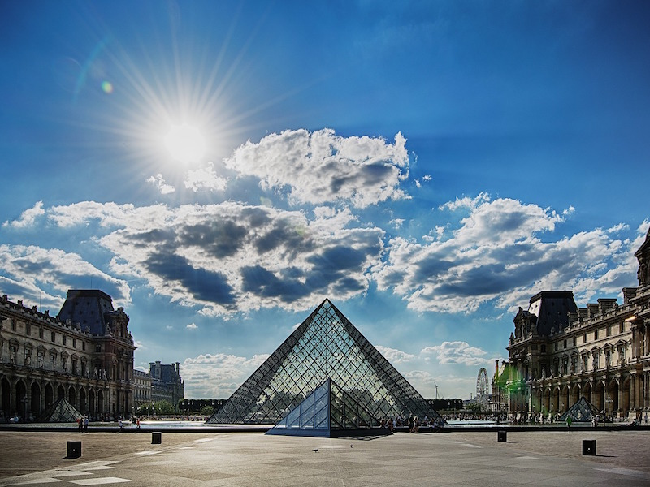
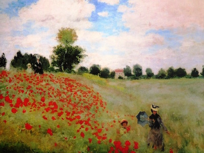
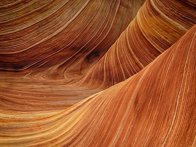
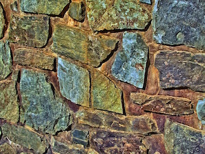

# Dynamic Multi-Style Transfer for Artistic Image Generation

## Overview

This repository contains the implementation and findings of the research project titled **Dynamic Multi-Style Transfer for Artistic Image Generation**. The project focuses on developing a robust and flexible system for real-time multi-style transfer using convolutional neural networks (CNNs). By leveraging the power of the VGG19 network and advanced neural training techniques, the system offers high-quality stylization with dynamic customization of style weight ratios while minimizing computational overhead.

---

### Example O
Below are examples showcasing the versatility of the system in blending multiple artistic styles:

- **Input Images:**
  - **Louvre Image:**
    
  
  - **Monet Image:**
    

  - **Sandstone Image:**
    

  - **Stylestone Image:**
    
  
These images demonstrate the blending of various artistic styles like Monet's impressionist brushwork, sandstone textures, and more. Below are side-by-side comparisons showcasing the system's versatility in dynamically transferring and combining these styles onto the content image.

- **Blended Output:**
  The final result (`result.jpg`) merges these styles into a cohesive artwork, illustrating the power of multi-style transfer.
  
  - **Final Artistic Output (result.jpg):**
    

---

